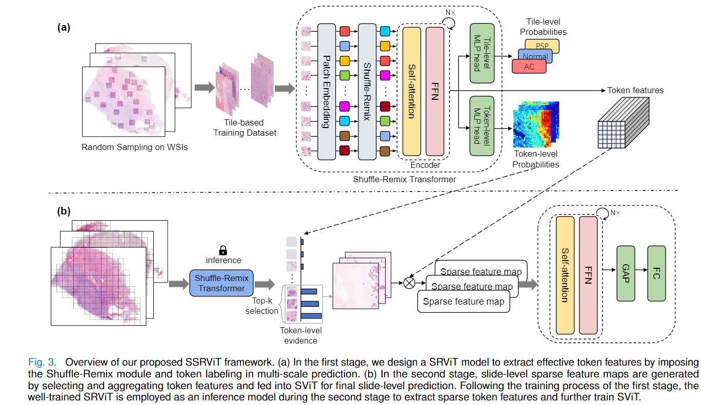

# Transformer Based Weakly Supervised Learning for Whole Slide Lung Cancer Image Classification

Code repository for our paper "Transformer Based Weakly Supervised Learning for Whole Slide Lung Cancer Image Classification".

## Requirements
- python 3.8.5
- numpy==1.23.5
- torch==1.13.1+cu116
- torchvision==0.14.1+cu116
- nystrom_attention==0.0.11
- pyvips==2.2.1
- timm==0.6.12

More details in [requirements.txt](./requirements.txt)

## Usage
1. Preprocess the whole slide images (WSIs): 
   - use [CLAM](https://github.com/mahmoodlab/CLAM) or other tools to extract tiles (patches) from WSIs
   - generate token-level masks for each patch based on coarse annotations (tissue mask if no coarse annotations are available)
   - split the dataset (slide-level or patient-level) with k-fold cross-validation
2. train SRViT for the first stage, more options for trainging and testing can be found in `main_stg1.py`:
   - `python main_stg1.py` 
   - or multi-gpu training: `torchrun --nproc_per_node=2 main_stg1.py`
3. extract the sparse feature embeddings from the trained SRViT model:
   - set `eval=True` and other extarct features settings in `main_stg1.py`
   - run `python main_stg1.py`
4. train the second stage with the extracted sparse feature embeddings:
   - `python main_stg2.py`
5. validate the final results in slide-level:
   - `python main_stg2.py --eval=True`

## Citation
If you find this code useful for your research, please consider citing:
```bash
@article{an2024transformer,
  title={Transformer-Based Weakly Supervised Learning for Whole Slide Lung Cancer Image Classification},
  author={An, Jianpeng and Wang, Yong and Cai, Qing and Zhao, Gang and Dooper, Stephan and Litjens, Geert and Gao, Zhongke},
  journal={IEEE Journal of Biomedical and Health Informatics},
  year={2024},
  publisher={IEEE}
}
```

## Acknowledgement
Our implementation is mainly based on the following codebases. We gratefully thank the authors for their wonderful works.

[pytorch-image-models](https://github.com/rwightman/pytorch-image-models), [nystrom-attention](https://github.com/lucidrains/nystrom-attention), [LV-ViT](https://github.com/zihangJiang/TokenLabeling)